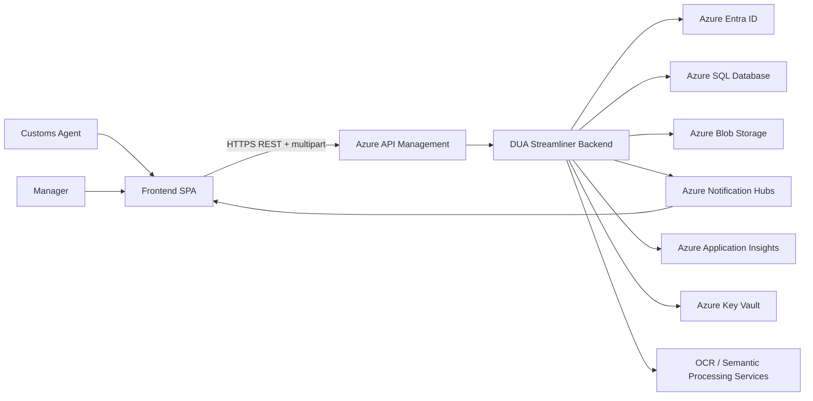
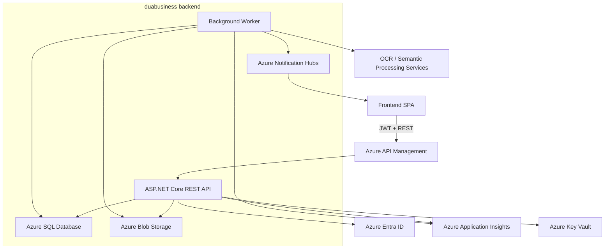
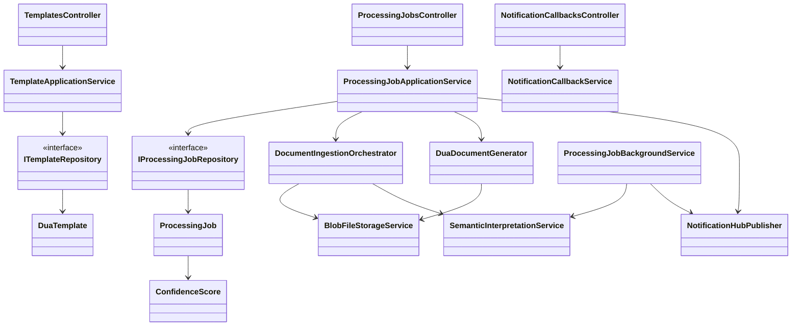

# DUA Streamliner

**Author:** Tomás Blando

## Monorepo Overview

DUA Streamliner is organized as a shared monorepo for the web client and the backend processing platform. The frontend remains in the existing `src/` folder, while the backend is scaffolded under `duabusiness/` as a layered `.NET` solution aligned with the same authentication, notification, observability, and environment model.

| Area | Path | Purpose |
| --- | --- | --- |
| Frontend | [`src/`](./src/) | Existing SPA structure for login, generator configuration, monitoring, export, and session management. |
| Backend | [`duabusiness/`](./duabusiness/) | Modular-monolith backend with API, application, domain, infrastructure, worker, tests, OpenAPI, Bicep, and Azure DevOps pipeline placeholders. |
| Wireframe asset | [`Wireframe.png`](./Wireframe.png) | Existing visual reference for the UI flow. |

## Frontend Design

### 1.1 Frontend Technology Stack

The existing frontend design remains the presentation layer for the platform and is kept untouched in this repository.

| Category | Technology | Version / Decision |
| --- | --- | --- |
| Application type | React SPA | Single-page application for authenticated business users |
| Framework | React | `19.2.1` |
| Language | TypeScript | `6.0.0-beta` |
| Runtime | Node.js | `21` |
| Bundler / dev server | Vite | `8.0.0` |
| State management | Redux Toolkit | `2.11.2` |
| Validation | Zod | `4.x` |
| Styling | Tailwind CSS | `4.1.0` |
| Unit testing | Vitest / Jest | `4.0.18` / `30.2.0` |
| E2E testing | Playwright | `1.58.x` |
| CI/CD | Azure DevOps Pipelines | Shared governance with backend delivery |
| Cloud hosting | Azure App Service | Frontend deployment target in the proposed Azure landscape |
| Observability | Azure Application Insights SDK | Client telemetry and error tracking |

### 1.2 UX / UI Analysis

The frontend supports five core user flows that the backend must honor:

1. `Login`: the user authenticates through Microsoft identity flow with MFA and enters the secure workspace.
2. `Configure Generator`: the user selects a target location, a DUA template, and required parameters, then receives validation feedback.
3. `Monitoring Progress`: the user tracks long-running jobs, sees logs and stage progress, and can react to failures or warnings.
4. `Result and Export`: the user previews generated output and downloads or exports the final DUA document.
5. `Logout`: the user terminates the session and loses access to protected resources.

These flows are the reason the backend exposes job-oriented APIs, asynchronous notification hooks, and strong status traceability.

### 1.3 Component Design Strategy

The frontend architecture described by the repository expects:

- Atomic design-style component composition.
- `src/styles/` as the home for shared tokens and global styles.
- `src/context/`, `src/hooks/`, `src/services/`, and `src/stores/` as the main composition points for auth, API access, and state.
- `src/i18n/` for localization assets.
- `src/pages/` for route-level screens corresponding to login, generator configuration, progress monitoring, and result delivery.

Relevant frontend folders:

- [`src/components/`](./src/components/)
- [`src/context/`](./src/context/)
- [`src/hooks/`](./src/hooks/)
- [`src/i18n/`](./src/i18n/)
- [`src/pages/`](./src/pages/)
- [`src/services/`](./src/services/)
- [`src/stores/`](./src/stores/)
- [`src/styles/`](./src/styles/)

### 1.4 Frontend Security

The frontend design already assumes Azure-native enterprise security, and the backend has been aligned to the same model:

- Authentication: Azure Entra ID with SSO and MFA.
- Main business roles: `Manager` and `CustomsAgent`.
- Secure API access: bearer tokens attached by the client API layer.
- Secret handling: environment-specific values provided through Azure Key Vault and pipeline variables.
- Observability alignment: client-side errors and backend traces converge in Azure Application Insights.

### 1.5 Frontend to Backend Alignment

The backend scaffold introduced in `duabusiness/` is intentionally synchronized with the frontend design:

- The frontend `login` and `session` expectations map to Azure Entra ID JWT validation in the API.
- The frontend `monitoring progress` flow maps to job status endpoints, worker processing, and Azure Notification Hubs.
- The frontend `result and export` flow maps to generated document retrieval from the backend.
- The shared environment model stays `dev`, `stage`, and `prod`.

## Backend Design

### 2.1 Backend Technology Stack

| Decision area | Selected technology | Why it fits DUA Streamliner |
| --- | --- | --- |
| Transport / application protocol | HTTPS over HTTP/1.1 and HTTP/2 | Ensures secure browser-to-API and service-to-service communication. |
| API style | REST API with JSON plus `multipart/form-data` uploads | Fits SPA integration, file intake, polling, and OpenAPI documentation. |
| Contract format | OpenAPI 3.0.3 | Formalizes backend/frontend integration and API Management publication. |
| Business logic paradigm | Clean Architecture with DDD-inspired aggregates | Keeps document workflows, templates, and user permissions explicit and testable. |
| Hosting model | Azure API Management in front of ASP.NET Core API on Azure App Service; separate worker on Azure App Service | Separates gateway governance from request handling and background processing. |
| Repository model | Monorepo, backend under `duabusiness/`, intended for Azure DevOps Repos | Keeps frontend and backend versioned together while matching the required delivery platform. |
| Service style | Modular monolith with asynchronous worker processing | Avoids premature microservice overhead while isolating OCR, parsing, and generation latency. |
| Framework choice | `.NET 8` and ASP.NET Core Web API | Stable LTS platform with strong Azure support. |
| Data store | Azure SQL Database | Central source of truth for jobs, templates, subscriptions, and audit metadata. |
| File store | Azure Blob Storage | Durable storage for source files, intermediate artifacts, and generated DUA documents. |
| Identity | Azure Entra ID | Aligns with the frontend’s Microsoft authentication flow. |
| Secrets | Azure Key Vault | Centralizes sensitive configuration with managed identity access. |
| Notifications | Azure Notification Hubs | Supports asynchronous progress and completion notifications for the frontend. |
| Observability | Azure Application Insights + Azure Monitor | Centralizes logs, metrics, traces, dashboards, and alerting. |
| Document processing adapters | OCR and semantic interpretation adapters, designed for Azure AI services or equivalent providers | Keeps OCR and AI interpretation behind interfaces while preserving Azure-first deployment decisions. |

The selected stack fits the system because DUA generation is a file-heavy, auditable, long-running workflow. A modular monolith preserves consistency and simpler release management, while the worker process shields the API from OCR and document-generation latency.

### 2.2 Backend Architecture Strategy

The backend is defined as a **modular monolith**, not a microservice system. This is the correct tradeoff for a first production-ready architecture because the workflow is strongly transactional around a single business capability: receiving evidence, extracting data, validating ambiguity, and generating one final DUA artifact.

The code is organized into five backend projects:

- [`DuaBusiness.Api`](./duabusiness/src/DuaBusiness.Api/) for HTTP endpoints, middleware, authentication setup, OpenAPI, and health exposure.
- [`DuaBusiness.Application`](./duabusiness/src/DuaBusiness.Application/) for use-case contracts, orchestration services, and validators.
- [`DuaBusiness.Domain`](./duabusiness/src/DuaBusiness.Domain/) for aggregates, value objects, roles, permissions, and repository interfaces.
- [`DuaBusiness.Infrastructure`](./duabusiness/src/DuaBusiness.Infrastructure/) for SQL persistence, blob storage, notification publishing, observability, security accessors, and document-processing adapters.
- [`DuaBusiness.Worker`](./duabusiness/src/DuaBusiness.Worker/) for asynchronous job execution and notification dispatch.

DDD concepts are applied through the main aggregates and value objects:

- `ProcessingJob` is the lifecycle aggregate for file intake, extraction, validation, and generation.
- `DuaTemplate` is the versioned aggregate for template configuration and publication.
- `NotificationSubscription` models async delivery preferences.
- `UserProfile`, `UserRole`, and `Permission` define authorization semantics.
- `ConfidenceScore` and `StorageReference` capture important business semantics without leaking infrastructure details.

The backend relates to the frontend as the secure processing core, and it relates to Azure services as follows:

- Azure API Management publishes and protects the REST API.
- Azure Entra ID authenticates users and supplies claims for role-based authorization.
- Azure Blob Storage stores uploaded evidence and generated DUA documents.
- Azure SQL stores job state, template versions, and audit metadata.
- Azure Notification Hubs publishes async status updates.
- Azure Application Insights and Azure Monitor observe the platform.

### 2.3 Security

Authentication and authorization:

- The API validates Azure Entra ID JWT bearer tokens.
- Authorization is policy-based in ASP.NET Core and aligned with frontend roles.
- `Manager` can manage template definitions and operational configuration.
- `CustomsAgent` can upload source files, trigger DUA generation, monitor progress, and download generated results.
- `PlatformOperator` is reserved for operational support and environment-level diagnostics.

Security controls:

- HTTPS/TLS 1.2+ is mandatory at Azure API Management and App Service.
- Azure SQL uses Transparent Data Encryption, and Blob Storage uses server-side encryption. Customer-managed keys can be introduced through Key Vault without changing the application architecture.
- Secrets are never stored in source control; runtime secrets come from Azure Key Vault and Azure DevOps variable groups.
- Baseline rate limiting is enforced in Azure API Management at `120 requests/minute/token`, with stricter throttles on upload endpoints.
- Upload payloads are capped at `50 MB` per request in the API scaffold and should be mirrored by gateway policy.
- Source files are retained for `30 days`, generated DUA documents for `180 days`, and audit trails for `365 days`.
- Network protection is implemented through API Management as the public ingress point, App Service access restrictions, and private connectivity for SQL, Storage, and Key Vault where the environment requires isolation.
- Audit logging covers login-bound API usage, uploads, template updates, generation requests, downloads, callback receipts, and manual-review transitions.

Security-related code and settings:

- [`Program.cs`](./duabusiness/src/DuaBusiness.Api/Program.cs)
- [`ApiServiceCollectionExtensions.cs`](./duabusiness/src/DuaBusiness.Api/Extensions/ApiServiceCollectionExtensions.cs)
- [`CurrentUserAccessor.cs`](./duabusiness/src/DuaBusiness.Infrastructure/Security/CurrentUserAccessor.cs)
- [`AuthorizationPolicyCatalog.cs`](./duabusiness/src/DuaBusiness.Infrastructure/Security/AuthorizationPolicyCatalog.cs)
- [`ApiSecurityOptions.cs`](./duabusiness/src/DuaBusiness.Infrastructure/Configuration/ApiSecurityOptions.cs)
- [`KeyVaultOptions.cs`](./duabusiness/src/DuaBusiness.Infrastructure/Configuration/KeyVaultOptions.cs)

### 2.4 Observability

The observability strategy is Azure-native and correlation-driven:

- Logging platform: Azure Application Insights receives structured logs from the API and worker.
- Metrics platform: Azure Monitor aggregates request counts, processing durations, ambiguous-field counts, failure rates, and worker heartbeat metrics.
- Tracing: OpenTelemetry-compatible correlation is designed around `x-correlation-id`, `HttpContext.TraceIdentifier`, and downstream propagation.
- Dashboards: Azure Monitor workbooks provide API latency, worker throughput, notification delivery, and template publication dashboards per environment.
- Events to log: upload accepted, extraction started, OCR completed, semantic interpretation completed, validation findings created, generation requested, generation completed, download issued, notification callback received, and unhandled exception.
- Health checks: live and ready endpoints are exposed at `/api/v1/health/live` and `/api/v1/health/ready`.

Observability-related files:

- [`ApplicationTelemetry.cs`](./duabusiness/src/DuaBusiness.Infrastructure/Observability/ApplicationTelemetry.cs)
- [`CorrelationIdMiddleware.cs`](./duabusiness/src/DuaBusiness.Api/Middleware/CorrelationIdMiddleware.cs)
- [`ExceptionHandlingMiddleware.cs`](./duabusiness/src/DuaBusiness.Api/Middleware/ExceptionHandlingMiddleware.cs)
- [`BlobStorageHealthCheck.cs`](./duabusiness/src/DuaBusiness.Infrastructure/Health/BlobStorageHealthCheck.cs)
- [`SqlDatabaseHealthCheck.cs`](./duabusiness/src/DuaBusiness.Infrastructure/Health/SqlDatabaseHealthCheck.cs)
- [`NotificationHubHealthCheck.cs`](./duabusiness/src/DuaBusiness.Infrastructure/Health/NotificationHubHealthCheck.cs)

### 2.5 Infrastructure and DevOps

Infrastructure and delivery decisions are explicit:

- Repository and CI/CD platform: Azure DevOps Repos, Pipelines, and Environments.
- Environments: `dev`, `stage`, and `prod`, each with isolated App Service apps, SQL database, storage containers, notification hub namespace, and telemetry.
- Deployment flow: build and test once, deploy to `dev`, promote to `stage`, then deploy to `prod` through controlled approvals.
- Release strategy: slot-based releases on Azure App Service, followed by smoke checks and controlled swap.
- IaC tool: Bicep, stored in [`duabusiness/infra/bicep/main.bicep`](./duabusiness/infra/bicep/main.bicep).
- Artifact strategy: zipped `dotnet publish` outputs for the API and worker; no container image is required for the initial delivery.
- Rollback strategy: slot swap rollback or redeploy of the last successful pipeline artifact.

Delivery artifacts:

- [`duabusiness/azure-pipelines.yml`](./duabusiness/azure-pipelines.yml)
- [`duabusiness/infra/bicep/main.bicep`](./duabusiness/infra/bicep/main.bicep)
- [`duabusiness/config/.env.example`](./duabusiness/config/.env.example)

### 2.6 Availability

Availability decisions:

- Uptime target: `99.9%` end-to-end service availability for the production workflow.
- Main single points of failure: Azure SQL availability, external OCR/AI provider availability, and Key Vault access for startup configuration.
- Recovery strategy: keep original uploaded evidence in Blob Storage, persist job state in SQL, and re-run failed jobs from durable state.
- Failover approach: use geo-redundant Blob Storage, point-in-time restore for SQL, and redeploy the worker/API to the paired region when regional recovery is required.
- Backup strategy: Azure SQL automated backups with PITR, Blob Storage redundancy, and immutable pipeline artifacts.
- Database HA strategy: zone-aware Azure SQL configuration with scale-up capability before introducing sharding.
- Timeouts and retries: API dependency calls target short timeouts (`30 seconds`), worker stages allow longer execution windows (`5 minutes` per external dependency call), retry transient faults up to `3` times with exponential backoff, and open a circuit after repeated provider failures to avoid cascading errors.

### 2.7 Scalability

Scalability decisions:

- Horizontal scaling: Azure API Management, the ASP.NET Core API, and the worker app can all scale out independently.
- Vertical scaling: Azure SQL scales vertically by service tier and vCore allocation; Blob Storage scales as a managed service.
- Caching strategy: template metadata and stable lookup data are designed for short-lived in-memory caching in the API, while Blob Storage and SQL remain the source of truth.
- Queue / worker strategy: the initial scaffold assumes a job-table-driven asynchronous worker model. The application service and worker boundaries are intentionally ready for a dedicated queue service in a later iteration without restructuring the domain.
- Expected bottlenecks as volume grows: OCR latency, AI semantic interpretation latency, Blob upload throughput for large evidence files, and SQL write contention on job-history tables.

### 2.8 Backend Key Workflows

#### Upload files to generate DUA

1. The frontend submits a `POST /api/v1/processing-jobs` request with files and template selection.
2. Azure API Management validates the request, enforces HTTPS, throttling, and payload policy.
3. The API authenticates the caller, assigns a correlation ID, and accepts the job.
4. The application layer creates a `ProcessingJob` and determines the required intake strategies.
5. Blob storage locations are reserved for the input files, and job state is persisted in SQL.
6. The worker picks up the queued job for background execution.

#### Process OCR, parsing, and extraction

1. The worker loads the source files from Blob Storage.
2. It selects extraction strategies according to file type: PDF, Word, Excel, or image OCR.
3. OCR is applied when the source document is image-based or scan-heavy.
4. Parsed values are normalized into the canonical field model.
5. The extraction result is attached to the job for downstream validation and generation.

#### Generate the DUA document

1. The user or an automated stage triggers `POST /api/v1/processing-jobs/{jobId}/generate`.
2. The application service loads the selected template definition and the extracted field set.
3. Semantic interpretation resolves field semantics and fills gaps that pure parsing cannot safely infer.
4. The DUA document generator produces the final `.docx` artifact.
5. The generated file is stored in Blob Storage and linked back to the job.

#### Validate data and flag ambiguous fields

1. Extracted fields are evaluated against template rules and business consistency rules.
2. Confidence scores are calculated for each field.
3. Low-confidence or conflicting values become `ValidationFinding` entries.
4. If ambiguity remains, the job transitions to `PendingManualReview` instead of silently generating a risky document.
5. The frontend can surface these findings in its monitoring and review screens.

#### Setup or update a DUA template

1. A manager sends `PUT /api/v1/templates/{templateId}` with metadata, storage path, and required fields.
2. The application layer version-controls the template definition.
3. The updated template becomes available for subsequent generation jobs.
4. The action is captured in the audit trail and published through OpenAPI documentation.

#### Download the generated DUA

1. The frontend requests `GET /api/v1/processing-jobs/{jobId}/download`.
2. The API verifies authorization and resolves the generated document reference.
3. A short-lived download URL or storage reference is returned to the client.
4. The download event is logged for traceability.

#### Asynchronous notification flow

1. The frontend registers a subscription through `POST /api/v1/notification-subscriptions`.
2. The backend stores the subscription and associates it with a processing job.
3. The worker publishes lifecycle events through Azure Notification Hubs as the job progresses.
4. The platform can receive provider acknowledgements through `POST /api/v1/notification-callbacks/notification-hub`.
5. The frontend updates its monitoring screen without relying only on polling.

### 2.9 C4 Architecture Diagrams

Only the required backend diagrams are included: **context**, **container**, and **code**.

#### Context Diagram



#### Container Diagram



#### Code Diagram



### 2.10 Source Code and Repository Map

#### Backend folder structure

```text
duabusiness/
├── azure-pipelines.yml
├── config/
│   └── .env.example
├── docs/
│   └── openapi/
├── infra/
│   └── bicep/
├── src/
│   ├── DuaBusiness.Api/
│   ├── DuaBusiness.Application/
│   ├── DuaBusiness.Domain/
│   ├── DuaBusiness.Infrastructure/
│   └── DuaBusiness.Worker/
└── tests/
    ├── DuaBusiness.UnitTests/
    ├── DuaBusiness.IntegrationTests/
    └── DuaBusiness.ArchitectureTests/
```

#### Architecture by layer

| Layer | Path | Responsibility | Key files |
| --- | --- | --- | --- |
| API | [`duabusiness/src/DuaBusiness.Api/`](./duabusiness/src/DuaBusiness.Api/) | Controllers, middleware, auth/OpenAPI bootstrap, health endpoints | [`Program.cs`](./duabusiness/src/DuaBusiness.Api/Program.cs), [`ProcessingJobsController.cs`](./duabusiness/src/DuaBusiness.Api/Controllers/ProcessingJobsController.cs), [`NotificationCallbacksController.cs`](./duabusiness/src/DuaBusiness.Api/Controllers/NotificationCallbacksController.cs) |
| Application | [`duabusiness/src/DuaBusiness.Application/`](./duabusiness/src/DuaBusiness.Application/) | Use-case contracts, validators, orchestration services | [`ProcessingJobApplicationService.cs`](./duabusiness/src/DuaBusiness.Application/Services/ProcessingJobApplicationService.cs), [`TemplateApplicationService.cs`](./duabusiness/src/DuaBusiness.Application/Services/TemplateApplicationService.cs), [`NotificationCallbackService.cs`](./duabusiness/src/DuaBusiness.Application/Services/NotificationCallbackService.cs) |
| Domain | [`duabusiness/src/DuaBusiness.Domain/`](./duabusiness/src/DuaBusiness.Domain/) | Aggregates, enums, value objects, repository interfaces | [`ProcessingJob.cs`](./duabusiness/src/DuaBusiness.Domain/Entities/ProcessingJob.cs), [`DuaTemplate.cs`](./duabusiness/src/DuaBusiness.Domain/Entities/DuaTemplate.cs), [`ConfidenceScore.cs`](./duabusiness/src/DuaBusiness.Domain/ValueObjects/ConfidenceScore.cs) |
| Infrastructure | [`duabusiness/src/DuaBusiness.Infrastructure/`](./duabusiness/src/DuaBusiness.Infrastructure/) | SQL persistence, blob storage, security accessors, notifications, health checks, document processing adapters | [`InfrastructureServiceCollectionExtensions.cs`](./duabusiness/src/DuaBusiness.Infrastructure/DependencyInjection/InfrastructureServiceCollectionExtensions.cs), [`BlobFileStorageService.cs`](./duabusiness/src/DuaBusiness.Infrastructure/Storage/BlobFileStorageService.cs), [`NotificationHubPublisher.cs`](./duabusiness/src/DuaBusiness.Infrastructure/Notifications/NotificationHubPublisher.cs), [`SemanticInterpretationService.cs`](./duabusiness/src/DuaBusiness.Infrastructure/Processing/SemanticInterpretationService.cs) |
| Worker | [`duabusiness/src/DuaBusiness.Worker/`](./duabusiness/src/DuaBusiness.Worker/) | Background execution of long-running job stages | [`ProcessingJobBackgroundService.cs`](./duabusiness/src/DuaBusiness.Worker/HostedServices/ProcessingJobBackgroundService.cs) |
| Tests | [`duabusiness/tests/`](./duabusiness/tests/) | Unit, integration, and architecture verification placeholders | [`ConfidenceScoreTests.cs`](./duabusiness/tests/DuaBusiness.UnitTests/Domain/ConfidenceScoreTests.cs), [`HealthEndpointsTests.cs`](./duabusiness/tests/DuaBusiness.IntegrationTests/Api/HealthEndpointsTests.cs), [`DependencyRulesTests.cs`](./duabusiness/tests/DuaBusiness.ArchitectureTests/Layering/DependencyRulesTests.cs) |

#### Supporting backend artifacts

- OpenAPI contract: [`duabusiness/docs/openapi/dua-streamliner.openapi.yaml`](./duabusiness/docs/openapi/dua-streamliner.openapi.yaml)
- Azure pipeline: [`duabusiness/azure-pipelines.yml`](./duabusiness/azure-pipelines.yml)
- Bicep IaC: [`duabusiness/infra/bicep/main.bicep`](./duabusiness/infra/bicep/main.bicep)
- Environment template: [`duabusiness/config/.env.example`](./duabusiness/config/.env.example)

This backend scaffold intentionally stops short of implementing business rules, OCR integration, and document-generation logic. What it provides is the complete structural base required to begin implementation inside a coherent Azure-oriented architecture that matches the frontend design already present in the monorepo.
